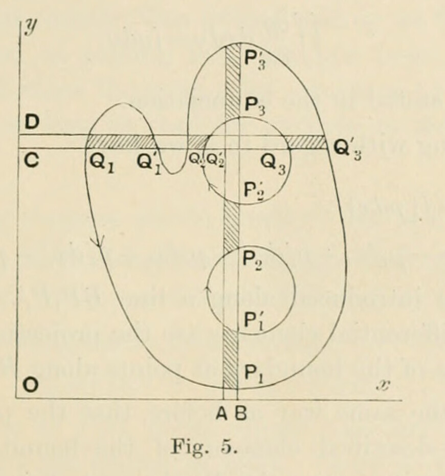

# §16. Fundamental lemma in integration

*Printed pages 24–27 (scans 0052–0055). Mathematical notation has been transcribed as TeX; Fig. 5 is a faithful crop from scan 0053. The wording follows the scans, with line wrapping normalized.*

The following lemma[^riemann] is of fundamental importance.

Let any region of the plane, on which the $z$-variable is represented, be bounded by one or more simple[^simple] curves which do not meet one another: each curve that lies entirely in the finite part of the plane will be considered to be a closed curve.

*If $p$ and $q$ be any two functions of $x$ and $y$, which, for all points within the region or along its boundary, are uniform, finite and continuous, then the integral*

$$
\iint\left(\frac{\partial q}{\partial x}-\frac{\partial p}{\partial y}\right)dx\,dy,
$$

*extended over the whole area of the region, is equal to the integral*

$$
\int(p\,dx+q\,dy),
$$

*taken in a positive direction round the whole boundary of the region.*

(As the proof of the proposition does not depend on any special form of region, we shall take the area to be (fig. 5) that which is included by the curve $Q_1P_1Q'_3P'_3$ and excluded by $P'_2Q'_2P_3Q_3$ and excluded by $P'_1P_2$. The positive directions of description of the curves are indicated by the arrows; and for integration in the area the positive directions are those of increasing $x$ and increasing $y$.)

First, suppose that both $p$ and $q$ are real. Then, integrating with regard to $x$, we have[^integration]

$$
\iint\frac{\partial q}{\partial x}\,dx\,dy=\int[q\,dy],
$$

where the brackets imply that the limits are to be introduced. When the limits are introduced along a line $CQ_1Q'_1\dots$ parallel to the axis of $x$, then, since $CQ_1Q'_1\dots$ gives the direction of integration, we have

$$
[q\,dy]
=-q_1\,dy_1+q'_1\,dy'_1-q_2\,dy_2+q'_2\,dy'_2-q_3\,dy_3+q'_3\,dy'_3,
$$

where the various differential elements are the projections on the axis of $y$ of the various elements of the boundary at points along $CQ_1Q'_1\dots$.

Now when integration is taken in the positive direction round the whole boundary, the part of $\int q\,dy$ arising from the elements of the boundary at the points on $CQ_1Q'_1\dots$ is the foregoing sum. For at $Q'_3$ it is $q'_3dy'_3$ because the positive element $dy'_3$, which is equal to $CD$, is in the positive direction of boundary integration; at $Q_3$ it is $-q_3dy_3$ because the positive element $dy_3$, also equal to $CD$, is in the negative direction of boundary integration; at $Q'_2$ it is $q'_2dy'_2$, for similar reasons; at $Q_2$ it is $-q_2dy_2$, for similar reasons; and so on. Hence

$$
[q\,dy],
$$

corresponding to parallels through $C$ and $D$ to the axis of $x$, is equal to the part of $\int q\,dy$ taken along the boundary in the positive direction for all the elements of the boundary that lie between those parallels. Then when we integrate for all the elements $CD$ by forming $\int[q\,dy]$, an equivalent is given by the aggregate of all the parts of $\int q\,dy$ taken in the positive direction round the whole boundary; and therefore

$$
\iint\frac{\partial q}{\partial x}\,dx\,dy=\int q\,dy,
$$

on the suppositions stated in the enunciation.

Again, integrating with regard to $y$, we have

$$
\begin{aligned}
\iint\frac{\partial p}{\partial y}\,dx\,dy
&=\int[p\,dx]\\
&=-p_1\,dx_1+p'_1\,dx'_1-p_2\,dx_2+p'_2\,dx'_2-p_3\,dx_3+p'_3\,dx'_3,
\end{aligned}
$$

when the limits are introduced along a line $BP_1P'_1\dots$ parallel to the axis of $y$: the various differential elements are the projections on the axis of $x$ of the various elements of the boundary at points along $BP_1P'_1\dots$.

It is proved, in the same way as before, that the part of $-\int p\,dx$ arising from the positively-described elements of the boundary at the points on $BP_1P'_1\dots$ is the foregoing sum. At $P'_3$ the part of $\int p\,dx$ is $-p'_3dx'_3$, because the positive element $dx'_3$, which is equal to $AB$, is in the negative direction of boundary integration; at $P_3$ it is $p_3dx_3$, because the positive element $dx_3$, also equal to $AB$, is in the positive direction of boundary integration; and so on for the other terms. Consequently

$$
-[p\,dx],
$$

corresponding to parallels through $A$ and $B$ to the axis of $y$, is equal to the part of $\int p\,dx$ taken along the boundary in the positive direction for all the elements of the boundary that lie between those parallels. Hence integrating for all the elements $AB$, we have as before

$$
\iint\frac{\partial p}{\partial y}\,dx\,dy=-\int p\,dx;
$$

and therefore

$$
\iint\left(\frac{\partial q}{\partial x}-\frac{\partial p}{\partial y}\right)dx\,dy
=\int(p\,dx+q\,dy).
$$

Secondly, suppose that $p$ and $q$ are complex. When they are resolved into real and imaginary parts, in the forms $p'+ip''$ and $q'+iq''$ respectively, then the conditions as to uniformity, finiteness and continuity, which apply to $p$ and $q$, apply also to $p'$, $q'$, $p''$, $q''$. Hence

$$
\iint\left(\frac{\partial q'}{\partial x}-\frac{\partial p'}{\partial y}\right)dx\,dy
=\int(p'\,dx+q'\,dy),
$$

and

$$
\iint\left(\frac{\partial q''}{\partial x}-\frac{\partial p''}{\partial y}\right)dx\,dy
=\int(p''\,dx+q''\,dy),
$$

and therefore

$$
\iint\left(\frac{\partial q}{\partial x}-\frac{\partial p}{\partial y}\right)dx\,dy
=\int(p\,dx+q\,dy):
$$

which proves the proposition.

No restriction on the properties of the functions $p$ and $q$ at points that lie without the region is imposed by the proposition. They may have infinities outside, they may cease to be continuous at outside points, or they may have branch-points outside; but so long as they are finite and continuous everywhere inside, and in passing from any one point to any other point always acquire at that other the same value whatever be the path of passage in the region, that is, so long as they are uniform in the region, the lemma is valid.

[^riemann]: It is proved by Riemann, *Ges. Werke*, p. 12, and is made by him (as also by Cauchy) the basis of certain theorems relating to functions of complex variables.
[^simple]: For the immediate purpose, a curve is called simple, if it have no multiple points. The aim, in constituting the boundary from such curves, is to prevent the superfluous complexity that arises from duplication of area on the plane. If, in any particular case, multiple points existed, a method of meeting the difficulty would be to take each simple loop as a boundary.
[^integration]: It is in this integration, and in the corresponding integration for $p$, that the properties of the function $q$ are assumed. Any deviation from uniformity, finiteness or continuity within the region of integration would render necessary some equation different from the one given in the text.
