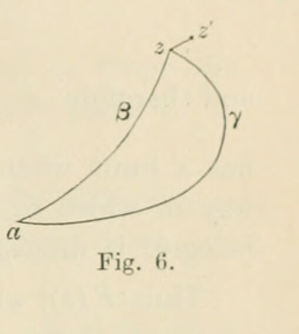

# §18. Integration of holomorphic functions

*Printed pages 29–30 (scans 0057–0058). Mathematical notation has been transcribed as TeX; Fig. 6 is a faithful crop from scan 0057. The wording follows the scans, with line wrapping normalized.*

*When a function $f(z)$ is holomorphic over any continuous region of the plane, the integral $\int_a^z f(z)\,dz$ is a holomorphic function of $z$, provided the points $z$ and $a$ as well as the whole path of integration lie within that region.*

The general definition (§14) of an integral is associated with a specified path of integration. In order to prove that the integral is a holomorphic function of $z$, it will be necessary to prove (i) that the integral acquires the same value in whatever way the point $z$ is attained, that is, that the value is independent of the path of integration, (ii) that it is finite, (iii) that it is continuous, and (iv) that it is monogenic.

Let two paths $a\gamma z$ and $a\beta z$ between $a$ and $z$ be drawn (fig. 6) in the continuous region of the plane within which $f(z)$ is holomorphic. The line $a\gamma z\beta a$ is a contour over the area of which $f(z)$ is holomorphic; and therefore $\int f(z)\,dz$ vanishes when the integral is taken along $a\gamma z\beta a$. Dividing the integral into two parts and implying by $z_\gamma$, $z_\beta$ that the point $z$ has been reached by the paths $a\gamma z$, $a\beta z$ respectively, we have

$$
\int_a^{z_\gamma}f(z)\,dz+\int_{z_\beta}^{a}f(z)\,dz=0,
$$

and therefore

$$
\begin{aligned}
\int_a^{z_\gamma}f(z)\,dz
&=-\int_{z_\beta}^{a}f(z)\,dz\\
&=\int_a^{z_\beta}f(z)\,dz.
\end{aligned}
$$

Thus the value of the integral is independent of the way in which $z$ has acquired its value; and therefore $\int_a^z f(z)\,dz$ is uniform in the region. Denote it by $F(z)$.

Secondly, $f(z)$ is finite for all points in the region. After the result of §17, we naturally consider only such paths between $a$ and $z$ as are finite in length, the distance between $a$ and $z$ being finite. Hence (§15, IV.) the integral $F(z)$ is finite for all points $z$ in the region.

Thirdly, let $z'$ $(=z+\delta z)$ be a point infinitesimally near to $z$; and consider $\int_a^{z'}f(z)\,dz$. By what has just been proved, the path from $a$ to $z'$ can be taken $a\beta zz'$; therefore

$$
\int_a^{z'}f(z)\,dz
=\int_a^z f(z)\,dz+\int_z^{z'}f(z)\,dz
$$

or

$$
\int_a^{z+\delta z}f(z)\,dz-\int_a^z f(z)\,dz
=\int_z^{z+\delta z}f(z)\,dz,
$$

so that

$$
F(z+\delta z)-F(z)=\int_z^{z+\delta z}f(z)\,dz.
$$

Now at points in the infinitesimal line from $z$ to $z'$, the value of the continuous function $f(z)$ differs only by an infinitesimal quantity from its value at $z$; hence the right-hand side is

$$
\{f(z)+\epsilon\}\delta z,
$$

where $|\epsilon|$ is an infinitesimal quantity vanishing with $\delta z$. It therefore follows that

$$
F(z+\delta z)-F(z)
$$

is an infinitesimal quantity with a modulus of the same order of small quantities as $|\delta z|$. Hence $F(z)$ is continuous for points $z$ in the region.

Lastly, we have

$$
\frac{F(z+\delta z)-F(z)}{\delta z}=f(z)+\epsilon;
$$

and therefore

$$
\frac{F(z+\delta z)-F(z)}{\delta z}
$$

has a limit when $\delta z$ vanishes; and this limit, $f(z)$, is independent of the way in which $\delta z$ vanishes. Hence $F(z)$ has a differential coefficient; the integral is monogenic for points $z$ in the region.

Thus $F(z)$, which is equal to

$$
\int_a^z f(z)\,dz,
$$

is uniform, finite, continuous, and monogenic; it is therefore a holomorphic function of $z$.

As in §16 for the functions $p$ and $q$, so here for $f(z)$, no restriction is placed on properties of $f(z)$ at points that do not lie within the region; so that elsewhere it may have infinities, or discontinuities, or branch-points. The properties, essential to secure the validity of the proposition, are (i) that no infinities or discontinuities lie within the region, and (ii) that the same value of $f(z)$ is acquired by whatever path in the continuous region the variable reaches its position $z$.

## Corollary

*No change is caused in the value of the integral of a holomorphic function between two points when the path of integration between the points is deformed in any manner, provided only that, during the deformation, no part of the path passes outside the boundary of the region within which the function is holomorphic.*

This result is of importance, because it permits the adoption of special forms of the path of integration without affecting the value of the integral.
