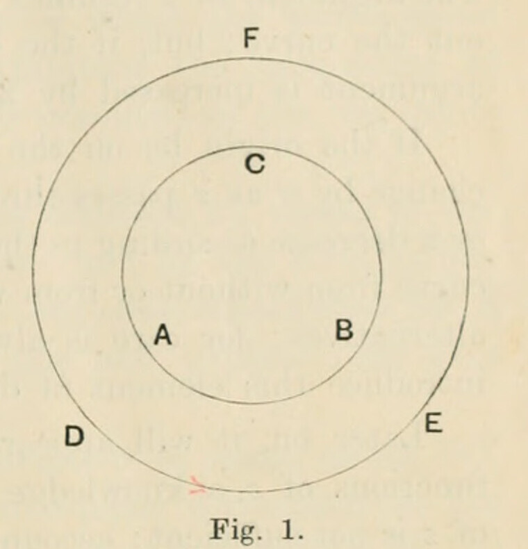

# §19. Deformation of paths of integration

*Printed pages 30–31 (scans 0058–0059). Mathematical notation has been transcribed as TeX; Fig. 1 is a faithful crop from scan 0031 (printed page 3), to which the text refers. The wording follows the scans, with line wrapping normalized.*

*When a function $f(z)$ is holomorphic over a part of the plane bounded by two simple curves (one lying within the other), equal values of $\int f(z)\,dz$ are obtained by integrating round each of the curves in a direction, which—relative to the whole area enclosed by each of them—is positive.*

The ring-formed portion of the plane (fig. 1, p. 3) which lies between the two curves is a region over which $f(z)$ is holomorphic; hence the integral $\int f(z)\,dz$ taken in the positive sense round the whole of the boundary of the included portion is zero. The integral consists of two parts: first, that round the outer boundary the positive sense of which is $DEF$; and second, that round the inner boundary the positive sense of which for the portion of area between $ABC$ and $DEF$ is $ACB$. Denoting the value of $\int f(z)\,dz$ round $DEF$ by $(DEF)$, and similarly for the other, we have

$$
(ACB)+(DEF)=0.
$$

The direction of an integral can be reversed if its sign be changed, so that

$$
(ACB)=-(ABC);
$$

and therefore

$$
(ABC)=(DEF).
$$

But $(ABC)$ is the integral $\int f(z)\,dz$ taken round $ABC$, that is, round the curve in a direction which, relative to the area enclosed by it, is positive.

The proposition is therefore proved.

The remarks made in the preceding case as to the freedom from limitations on the character of the function at places not within the bounded area are valid also in this case.

## Corollary I

*When the integral of a function is taken round the whole of any simple curve in the plane, no change is caused in its value by continuously deforming the curve into any other simple curve provided the function is holomorphic over the part of the plane in which the deformation is effected.*

## Corollary II

*When a function $f(z)$ is holomorphic over a continuous portion of a plane bounded by any number of simple non-intersecting curves, all but one of which are external to one another and the remaining one of which encloses them all, the value of the integral $\int f(z)\,dz$ taken positively round the single external curve is equal to the sum of the values taken round each of the other curves in a direction which is positive relative to the area enclosed by it.*

These corollaries are of importance in many instances, as will be seen later. The simplest instances arise in finding the value of the integrals of meromorphic functions round a curve which encloses one or more of the poles; the fundamental theorem, also due to Cauchy, for these integrals is the following.
